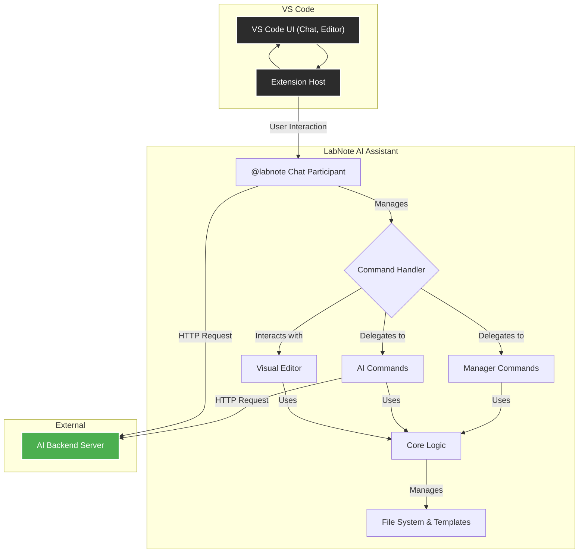
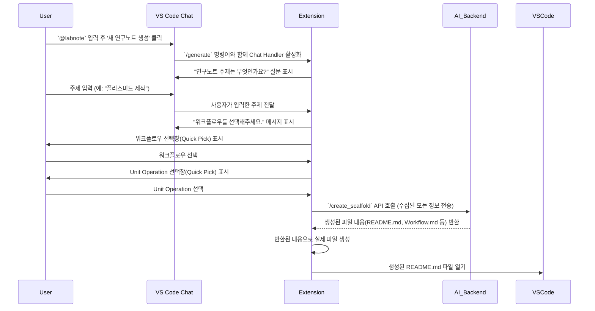
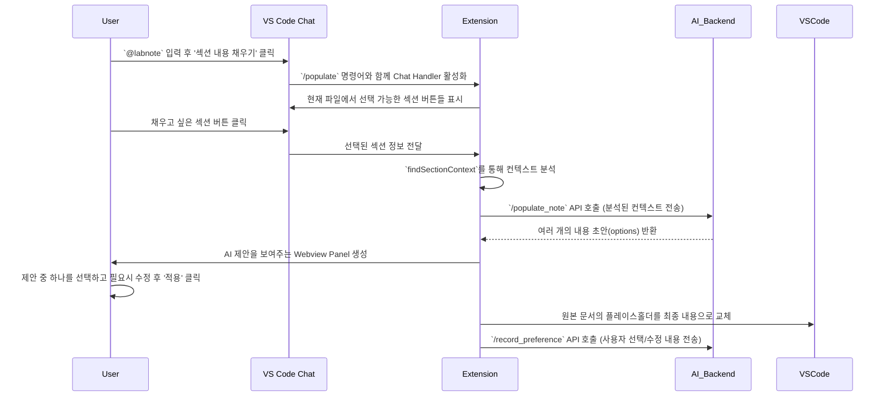

알겠습니다. 기존 `README.md` 파일에 **대화형 AI 기능**을 중심으로 내용을 보강하고, 전체적으로 더 명확하게 기능을 설명하도록 업데이트했습니다.

수정된 `README.md` 파일의 전체 내용은 다음과 같습니다.

-----

# 🔬 LabNote AI Assistant

**LabNote AI Assistant**는 Visual Studio Code에서 연구노트 작성을 돕는 AI 기반 확장 프로그램입니다. 복잡한 실험 과정의 문서화를 간소화하고, 표준화된 템플릿을 통해 체계적인 기록 관리를 지원하며, AI 기능을 활용하여 연구노트의 초안 생성 및 내용 채우기를 자동화합니다.

-----

## 목차

1.  [주요 기능](#-주요-기능)
2.  [아키텍처](#-아키텍처)
3.  [핵심 워크플로](#-핵심-워크플로)
    * [AI 기반 새 연구노트 생성](#ai-기반-새-연구노트-생성-워크플로)
    * [AI 섹션 내용 채우기](#ai-섹션-내용-채우기-워크플로)
4.  [설치](#-설치)
5.  [사용법 (명령어)](#-사용법-명령어)
6.  [설정](#-설정)
7.  [데이터 활용 및 저작권 정책](#-데이터-활용-및-저작권-정책)
8.  [기여](#-기여)

-----

## ✨ 주요 기능

  * **대화형 AI 어시스턴트 (`@labnote`)**: VS Code 채팅창에서 `@labnote`를 호출하여 AI와 대화하며 연구노트 생성, 섹션 채우기 등 대부분의 기능을 직관적으로 실행할 수 있습니다.
  * **AI 기반 연구노트 자동 생성**: 실험의 핵심 내용을 AI와의 대화를 통해 전달하면, AI가 최적의 워크플로우와 Unit Operation을 조합하여 연구노트의 전체 구조와 파일(Scaffold)을 자동으로 생성합니다.
  * **AI 섹션 내용 채우기**: 연구노트의 각 섹션(Method, Reagent, Results 등)을 AI를 통해 자동으로 채울 수 있습니다. 여러 초안 중 원하는 것을 선택하고 수정하여 AI를 학습시킬 수 있습니다.
  * **Visual Editor**: 마크다운 문법에 익숙하지 않은 사용자를 위해 직관적인 WYSIWYG 편집 환경을 제공합니다.
  * **체계적인 템플릿 관리**: `Workflows`, `Hardware/Software Unit Operations` 등 표준화된 템플릿을 쉽게 추가하고 관리할 수 있습니다.
  * **번호 자동 재정렬**: 실험 폴더나 워크플로우 파일의 번호를 자동으로 정렬하여 일관성을 유지합니다.

-----

## 🏗️ 아키텍처

LabNote AI Assistant는 VS Code 확장 프로그램 API를 기반으로, AI 백엔드 서버와 통신하여 핵심 기능을 수행합니다. 주요 구성 요소는 다음과 같습니다.

  * **Extension Host (`extension.ts`)**: 확장 프로그램의 진입점으로, 모든 명령어, 이벤트 리스너, UI(Visual Editor, Chat Participant)를 등록하고 관리합니다.
  * **@labnote Chat Participant**: VS Code 채팅 UI에서 사용자와의 상호작용을 담당합니다. 사용자의 입력을 해석하여 적절한 명령을 실행하고, 다단계 대화를 통해 정보를 수집합니다.
  * **Command Handler**: `@labnote`를 통해 전달된 명령이나 Command Palette 명령을 처리하고 적절한 모듈로 작업을 위임합니다.
  * **AI Commands**: `새 연구노트 생성`, `섹션 내용 채우기` 등 AI 백엔드 서버와 통신이 필요한 기능을 담당합니다.
  * **Manager Commands**: `새 워크플로우 추가`, `번호 재정렬` 등 로컬 파일 시스템과 템플릿을 관리하는 기능을 담당합니다.
  * **Core Logic (`logic.ts`)**: 워크플로우 및 Unit Operation 파싱, 파일 생성, YAML Front Matter 처리 등 확장 프로그램의 핵심 비즈니스 로직을 포함합니다.
  * **Visual Editor (`LabnoteEditorProvider`)**: `.md` 파일을 위한 WYSIWYG 편집기를 제공하며, AI 기능 버튼을 포함합니다.
  * **AI Backend Server**: 자연어 처리, 연구노트 구조 생성, 섹션 내용 제안 등 복잡한 AI 연산을 수행하고 결과를 VS Code로 반환합니다.

-----

## ⚡ 핵심 워크플로

### AI 대화형 새 연구노트 생성 워크플로

사용자가 `@labnote`와 대화하여 새 연구노트를 생성할 때의 내부 처리 흐름입니다.

### AI 섹션 내용 채우기 워크플로

`@labnote`를 통해 섹션 내용을 채울 때의 처리 흐름입니다.

-----

## 📥 설치

1.  Visual Studio Code를 엽니다.
2.  `Ctrl+Shift+X`를 눌러 확장 프로그램 마켓플레이스를 엽니다.
3.  `LabNote AI Assistant`를 검색합니다.
4.  **Install** 버튼을 클릭합니다.

-----

## 🚀 사용법

### 🤖 AI 어시스턴트와 대화하기 (`@labnote`)

VS Code의 채팅 뷰에서 `@labnote`를 입력하여 AI 어시스턴트를 호출하는 것이 가장 권장되는 사용법입니다.

1.  **시작**: 채팅창에 `@labnote`를 입력하면 시작 메뉴가 나타납니다.
2.  **기능 선택**: 버튼을 클릭하여 원하는 기능을 대화형으로 실행합니다.
      * **🔬 새 연구노트 생성**: AI의 질문에 따라 '주제 -\> 워크플로우 -\> Unit Operation' 순서로 답변하며 연구노트를 생성합니다.
      * **✍️ 섹션 내용 채우기 (AI)**: 현재 열린 파일에서 채우고 싶은 섹션을 버튼으로 선택하여 AI 제안을 받습니다.
3.  **일반 질문**: `@labnote [질문 내용]` 형식으로 과학적 지식이나 실험 아이디어에 대해 자유롭게 질문할 수 있습니다.
4.  **작업 취소**: 대화 중간에 `/cancel`을 입력하여 언제든지 현재 작업을 중단할 수 있습니다.

### ⌨️ 명령어 팔레트

`Ctrl+Shift+P`를 눌러 명령어 팔레트를 열고 `LabNote:`를 입력하여 개별 기능을 직접 실행할 수도 있습니다.

| 명령어 | 설명 |
| --- | --- |
| `LabNote: 새 연구노트 생성` | AI를 사용하여 새로운 실험 폴더와 연구노트 구조를 생성합니다. (대화형이 아닌 입력창 방식) |
| `LabNote (AI): 섹션 내용 채우기`| (텍스트 에디터) 현재 커서가 위치한 섹션의 플레이스홀더를 AI로 채웁니다. |
| `LabNote: 새 워크플로우 추가` | 현재 연구노트(`README.md`)에 표준화된 워크플로우를 추가합니다. |
| `LabNote: HW/SW Unit Operation 추가`| 현재 워크플로우 파일에 Unit Operation을 추가합니다. |
| `LabNote: 템플릿 관리` | 워크플로우 및 Unit Operation 템플릿 파일을 직접 열어 수정합니다. |
| `LabNote: 표 삽입` | 마크다운 표를 쉽게 삽입합니다. |
| `LabNote: 워크플로우 번호 재정렬` | 현재 실험 폴더 내의 워크플로우 파일 번호(`001_`, `002_`...)를 순서대로 재정렬합니다. |
| `LabNote: 실험 폴더 번호 재정렬` | `labnote` 폴더 내의 모든 실험 폴더 번호를 순서대로 재정렬합니다. |

-----

## ⚙️ 설정

`Ctrl+,`를 눌러 설정을 열고 `LabNote`를 검색하여 확장 프로그램 관련 설정을 변경할 수 있습니다.

| 설정 | 설명 | 기본값 |
| --- | --- | --- |
| `labnote.ai.backendUrl` | LabNote AI 백엔드 서버의 기본 URL입니다. | `http://127.0.0.1:8000` |
| `labnote.ai.vesslApiToken`| VESSL.ai 서비스 엔드포인트 인증을 위한 API 토큰입니다. | `""` |
| `labnote.manager.workflowsPath` | 사용자 정의 워크플로우 마크다운 파일의 경로입니다. | `""` |
| `labnote.manager.hwUnitOperationsPath`| 사용자 정의 하드웨어 Unit Operation 마크다운 파일의 경로입니다. | `""` |
| `labnote.manager.swUnitOperationsPath`| 사용자 정의 소프트웨어 Unit Operation 마크다운 파일의 경로입니다. | `""` |

-----

## ⚖️ 데이터 활용 및 저작권 정책

### 데이터 활용 동의

`AI 섹션 내용 채우기` 기능을 최초로 사용할 때, AI 모델 성능 향상을 위한 데이터 활용 동의를 요청합니다.

  * **동의 시**: 사용자가 AI가 제안한 여러 초안 중 **최종 선택한 내용**과, 이를 **수정한 내용**이 익명화되어 서버로 전송됩니다. 이 데이터는 AI 모델을 학습(Direct Preference Optimization)시키는 데에만 사용됩니다.
  * **거부 시**: `AI 섹션 내용 채우기` 기능이 비활성화됩니다. 다른 AI 기능(새 연구노트 생성, 일반 대화)은 정상적으로 사용할 수 있습니다.

### 저작권

  * **사용자 생성 콘텐츠**: 사용자가 이 확장 프로그램을 통해 작성하고 수정한 모든 연구노트의 저작권은 **사용자**에게 있습니다.
  * **AI 생성 콘텐츠**: AI가 생성한 초안은 사용자의 작업을 돕기 위한 보조 자료이며, 최종 콘텐츠에 대한 책임과 권리는 이를 채택하고 수정한 사용자에게 귀속됩니다.